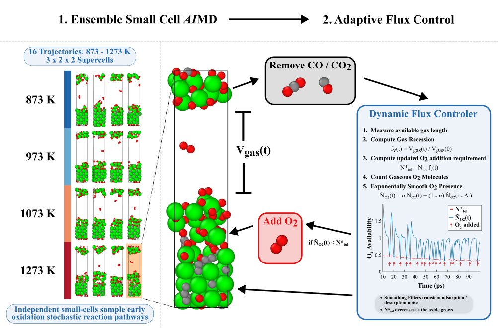

# SGUSCHI

**SGUSCHI** (Solid-Gas in Ultra Small Coexistence with Hovering Interfaces) is a fork of [SLUSCHI](https://github.com/qjhong/SLUSCHI) for simulating pure O₂ oxidation environments using the small-cell methodology. It couples the SLUSCHI cluster Fortran MD orchestrator with a Python analysis layer: every 80 VASP MD steps, the Python layer detects and removes non-O₂ gas molecules, tracks the void fraction, and conditionally inserts new O₂ molecules based on an exponentially smoothed count. Outputs gas management CSVs and xyz data for easy analysis.

<p align="center">
  
</p>
Paper can be found at (insert doi here)

Insert lisence here


## Requirements

- **Python** ≥ 3.8 with `numpy`, `pandas`, `scipy`
- **VASP** (tested with standard and MLFF modes)
- **Fortran compiler** (gfortran or ifort) to build the SLUSCHI binary
- **Job scheduler**: tested on **Slurm** and **PBS Torque**
- Optional (postprocessing): `plotly`, `tqdm`

## Installation

```bash
# Build the Fortran orchestrator
cd src/dependencies/SLUSCHI_mod
make
chmod +x *

# Install Python dependencies
pip install numpy pandas scipy
```

## Quick Start

The `example/` directory contains a ready-to-use starting point (with empty POTCAR). See `example/note.md` for a full walkthrough. The steps are:

1. Copy the `example/` folder to your workspace and populate it:
   `POSCAR` (supercell, no O atoms, no gas region), `POTCAR`, `INCAR`, `KPOINTS`,
   `job.in`, `jobsub`, `OxParams`, `CovalentRadii`.
2. Customise `OxidationMaster`: set the `#SBATCH` tags, `module load` lines for your
   cluster, and the path to `SGUSCHI.py`.
3. Submit and resubmit as needed:
   ```bash
   sbatch OxidationMaster
   ```
   `SGUSCHI.py` handles everything automatically: folder creation, initial VASP job
   submission, and running `volsearch_cont` in all simulation directories.
4. Results are written to `xyz_files/`.

> **Scheduler command:** `vaspcmd` in `job.in` controls how VASP jobs are submitted
> (e.g. `vaspcmd = sbatch` for Slurm, `vaspcmd = qsub` for PBS Torque). `SGUSCHI.py`
> reads this key to submit the initial VASP job in each `Dir_VolSearch` — set it to
> match your cluster scheduler before running.

## Configuration Reference

### OxParams

| Key | Description |
|-----|-------------|
| `AtomicRadiusTol` | Multiplier applied to the sum of covalent radii for bond detection |
| `O2Tol` | Target O₂ count per unit void fraction |
| `OSmoothing` | Exponential smoothing factor α for O₂ count (default 0.001; heavily history-weighted) |
| `GasRatio` | Fraction by which the x-axis is expanded to create the gas region |
| `InitO2Count` | Number of O₂ molecules placed at initialisation |
| `Temperatures` | List of simulation temperatures in K |
| `NSims` | Number of parallel simulation replicas per temperature |

### CovalentRadii

Plain text file, one entry per line: `Element = radius_in_Angstroms`. Supports `#` and `!` comments.

### INCAR (required settings)

| Tag | Value | Reason |
|-----|-------|--------|
| `IBRION` | `0` | Molecular dynamics mode |
| `ISIF` | `2` | Fixed cell shape; ions relax |
| `NSW` | `80` | Steps per SLUSCHI cycle (overridden at runtime; do not change here) |

### job.in

SLUSCHI volume-search configuration. Preconfigured settings work well.

## Architecture

SGUSCHI wraps the SLUSCHI volume-search loop. `volsearch_cont` is a csh script that drives the full MD run. Each cycle it:

1. **Polls** for job completion (checks for `Total CPU` in OUTCAR every 60 s).
2. **Extracts pressure/stress** from the finished OUTCAR: Pulay stress, full stress tensor, kinetic pressure from temperature and volume.
3. **Predicts the next lattice** by running `DetermineSize.x` on the averaged pressure history (volume-search step; inherited from SLUSCHI).
4. **Adjusts INCAR tags**: `AdjustPOTIM` (timestep), `AdjustNBANDS` (band count), `AdjustBMIX` (mixing parameter).
5. **Archives the completed step**: creates a numbered folder (`1/`, `2/`, …), moves OUTCAR into it, copies INCAR/KPOINTS/POSCAR/OSZICAR, and touches an empty OUTCAR in place.
6. **Builds the next POSCAR**: header and species lines from CONTCAR, new lattice vectors from `DetermineSize.x`, then atom positions and velocities from CONTCAR (i.e. the last MD snapshot becomes the starting point).
7. **Calls `OxidationStep.py`**, which updates the gas environment (see below).
8. **Submits the next VASP job** via the configured `vaspcmd`.

```
volsearch_cont (csh)
    │  [startup] read ~/.sluschi.rc; set SIGMA/TEBEG/TEEND/NSW/SMASS in INCAR from job.in
    │
    └─ loop: poll OUTCAR → job done
            ├─ compute pressure, run DetermineSize.x → lattice_predict.out
            ├─ adjust INCAR (POTIM, NBANDS, BMIX)
            ├─ archive step N: mkdir N/, mv OUTCAR N/, cp inputs, touch OUTCAR
            ├─ build POSCAR: CONTCAR header + new lattice + CONTCAR positions/velocities
            ├─ python OxidationStep.py
            │       ├─ Reads:  POSCAR, {N}/OUTCAR, OxParams, CovalentRadii, RateAnalysis.csv
            │       ├─ Calls OxidationAnalysis: gas detection, smoothing, O2 placement
            │       └─ Writes: updated POSCAR, RateAnalysis.csv, XYZ trajectory
            └─ submit next VASP job; advance step counter
```

If `OxidationStep.py` exits with a non-zero status, `volsearch_cont` halts immediately and writes a `sguschi_failed` marker file.

## Known Limitations

1. **Material system**: Void-fraction tracking uses Zr atoms as the solid reference. The code has been tested on **cubic Zr refractory materials** (e.g. ZrC, ZrN) in a pure O₂ environment only.
2. **Structure geometry**: Cubic bulk structures only. The origin-shifting heuristic in `OxidationPreprocessing.py` assumes roughly equal inter-atom spacing; non-cubic and slab geometries are not supported.
3. **Cell orientation**: The gas void region must lie along the **x-axis** (first lattice vector). Gas fraction tracking, O₂ placement, and surface area calculations all assume this orientation.
4. **Gas addition**: Only **pure O₂** can be added. The O–O bond length is hardcoded to 1.2 Å and velocities are drawn from a Maxwell–Boltzmann distribution for two O atoms.
5. **Gas removal**: Only molecules of **2–3 atoms** are detected (`MinimumComplexity=2`, `MaximumComplexity=3`). All detected non-O₂ molecules are removed each cycle.
6. **Oxygen in base structure**: The base POSCAR must not contain oxygen atoms. This combination has not been tested.
7. **Fixed cell**: Cell shape and volume are fixed during MD (`ISIF=2`). Variable-cell MD is not supported.
8. **MD cycle length**: One Python cycle runs every **80 VASP MD steps**. This is enforced by `volsearch_cont` at runtime and cannot be changed by editing `INCAR` or `job.in` alone; the SLUSCHI script source must be modified.
9. **Elemental masses**: Velocity initialisation covers O, C, Zr, and N only. Additional elements must be manually added to the mass dictionary in `src/workflow/OxidationAnalysis.py`.
