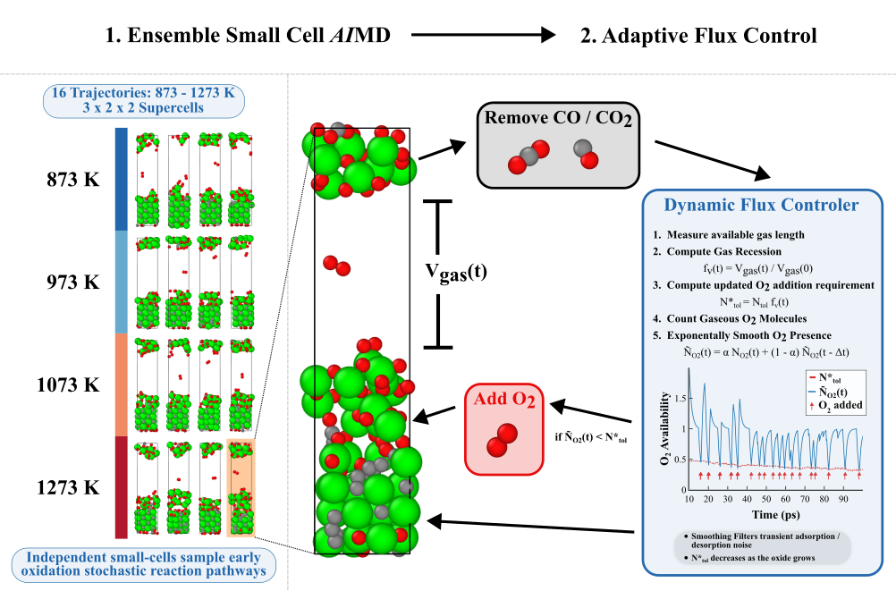

# SGUSCHI

**SGUSCHI** (Solid-Gas in Ultra Small Coexistence with Hovering Interfaces) is a
fork of [SLUSCHI](https://github.com/qjhong/SLUSCHI) for simulating pure O₂
oxidation environments using the small-cell methodology. It couples the SLUSCHI
MD workflow with Python gas analysis: every 80 VASP MD steps, SGUSCHI removes
detected non-O₂ gas molecules, tracks the void fraction, and conditionally adds
O₂ based on an exponentially smoothed molecule count. Results include XYZ
trajectories and gas-management CSV files.

<p align="center">
  
</p>

## Supported systems

The workflow has been tested on **cubic Zr refractory materials**, such as ZrC
and ZrN, in **pure O₂**. Start with a bulk supercell containing no oxygen and no
pre-existing gas region; preprocessing creates the gas region along the x-axis.
Void tracking currently relies on Zr atoms. See [Known limitations](#known-limitations)
for the full material, geometry, and gas-model restrictions.

## Contents

- [Requirements and installation](#requirements-and-installation)
- [Quick start: one specification](#quick-start)
- [Multiple job specifications with one controller](#multiple-job-specifications-with-one-controller)
- [Monitoring and outputs](#monitoring-and-outputs)
- [Resuming and extending runs](#resuming-and-extending-runs)
- [Configuration reference](#configuration-reference)
- [Developer information](#developer-information)
- [Known limitations](#known-limitations)
- [Citation and license](#citation-and-license)

## Requirements and installation

### Requirements

- **Python ≥ 3.8** with `numpy`, `pandas`, and `scipy`.
- **VASP**, licensed and working; standard and MLFF modes have been tested.
- **Fortran compiler**, such as `ifort`, `ifx`, or `gfortran`, to build the helpers.
- **C shell (`csh`)** for the SLUSCHI control scripts.
- **Job scheduler**: tested with Slurm and PBS Torque. The supplied master script
  uses Slurm; adapt its directives and submission command for PBS.
- Optional postprocessing dependencies: `plotly`, `tqdm`.

### Installation

From the cloned repository root:

```bash
python -m pip install numpy pandas scipy

# The Makefile defaults to ifort. Use CC=ifx or CC=gfortran as appropriate.
cd src/dependencies/SLUSCHI_mod
make CC=ifort
chmod +x *
cd ../../..

# Optional postprocessing dependencies
python -m pip install plotly tqdm
```

For development dependencies and test commands, see [Testing](#testing).

## Quick start

This starts one specification with any number of temperatures and replicas.
The [example directory](example/) contains input templates; its `POTCAR` is empty
and must be supplied. See the [example notes](example/note.md) for a compact
input checklist.

1. Copy the example into a separate simulation workspace. Customize `POSCAR`,
   `POTCAR`, `INCAR`, `KPOINTS`, `job.in`, `jobsub`, `OxParams`, and `CovalentRadii`.
   The [configuration reference](#configuration-reference) describes each file.
2. In `OxParams`, leave `JobSpecs = []` or omit it. Set temperatures and replicas,
   along with the gas settings. For example:

   ```python
   Temperatures = [873, 973]
   NSims = 4
   ```

   This produces **four trajectories per temperature**, eight in total, with
   names such as `873_1`, `873_2`, and `973_1`.
3. Configure `jobsub` to launch VASP on your cluster. Set `vaspcmd` in `job.in`
   to the scheduler command, such as `sbatch` or `qsub`. Customize
   `OxidationMaster`: scheduler directives, module loads, and the absolute path
   to `SGUSCHI.py`.
4. From the simulation workspace, inspect and optionally prepare the run:

   ```bash
   python /path/to/SGUSCHI/src/SGUSCHI.py . --dry-run
   python /path/to/SGUSCHI/src/SGUSCHI.py . --prepare-only
   ```

   Replace `/path/to/SGUSCHI` with your clone's location. `--dry-run` reports the
   plan without writing files. `--prepare-only` creates missing run folders and
   applies the [initial INCAR settings](#incar-required-settings), without
   submitting jobs or clearing completion markers. It also initializes older
   prepared folders that have never been submitted. Inputs of queued or
   previously started trajectories are preserved. Both commands can be used
   on a login node.
5. Submit the master job from the same workspace:

   ```bash
   sbatch OxidationMaster
   ```

   Normal submission also prepares missing folders, so step 4 is optional.
   The controller submits initial VASP jobs and starts `volsearch_cont` for all
   pending trajectories. Continue with [Monitoring and outputs](#monitoring-and-outputs).

For a manual first VASP submission after `--prepare-only`, work inside the
chosen trajectory's `Dir_VolSearch`. With the controller stopped and no VASP
job already queued or running there, record the first-step submission guard
before submitting:

```bash
cd 873_1/Dir_VolSearch  # In grouped mode, include the specification's path
printf '1\n' > .vasp_submitted_step && sbatch jobsub
```

Use `qsub` instead if configured for PBS. This guard prevents a later controller
start from submitting the same job again while the manual job is still queued
and has no `OUTCAR`. If submission is definitely rejected, remove the guard
before retrying; after an ambiguous scheduler timeout, check the queue first.
Normally, submitting `OxidationMaster` handles this bookkeeping automatically.

## Multiple job specifications with one controller

Use grouped specifications to run different starting compositions or O₂-control
settings together. Each specification is a complete workspace with its own
inputs, temperatures, replica count, and optional runtime cap.

1. Create a campaign directory with one `OxidationMaster` and one top-level
   `OxParams`. Create a child directory for each specification, using the same
   input files as in the [quick start](#quick-start):

   ```text
   campaign/
   ├── OxidationMaster
   ├── OxParams                     # JobSpecs list
   ├── ZrC_low/
   │   ├── OxParams                 # Scientific settings, temperatures, replicas
   │   ├── POSCAR, POTCAR, INCAR, KPOINTS
   │   ├── job.in, jobsub, CovalentRadii
   │   ├── 873_1/Dir_VolSearch/      # Generated during preparation
   │   └── xyz_files/               # This specification's trajectories
   ├── ZrC_high/
   │   └── ...
   └── ZrN_low/
       └── ...
   ```

2. Put the specification list on one line in the top-level `OxParams`:

   ```python
   JobSpecs = ["ZrC_low", "ZrC_high", "ZrN_low"]
   ```

   Quotes are optional for simple paths, and quoted/unquoted entries can be
   mixed. This is equivalent:

   ```text
   JobSpecs = [ZrC_low, ZrC_high, ZrN_low]
   ```

   Every unquoted entry is read as literal text: `1.20` and `001` retain their
   exact spelling. This behavior applies only to `JobSpecs`; expressions and
   malformed lists are rejected. Use quotes around parent paths containing
   spaces or commas.

   `JobSpecs` is optional and disabled by default: omitting it or setting it to
   `[]` uses the single-workspace layout. When enabled, the top-level file only
   needs this list; scientific settings there are ignored. Child workspaces do
   not inherit inputs or settings from the campaign root.
3. Customize each child's complete inputs. Leave its `JobSpecs` empty or omit
   it. `NSims` applies **per temperature within that specification**, and can
   differ between children. For example, two temperatures with `NSims = 3`
   create six trajectories in that child.
4. Configure the top-level `OxidationMaster` as in the quick start. From the
   campaign directory, use the same inspection, preparation, and submission
   commands:

   ```bash
   python /path/to/SGUSCHI/src/SGUSCHI.py . --dry-run
   python /path/to/SGUSCHI/src/SGUSCHI.py . --prepare-only
   sbatch OxidationMaster
   ```

Use paths relative to the campaign, preferably with forward slashes. Workspaces
can sit directly under the campaign root; a `jobs/` folder is optional. If you
use one, include it in each path, e.g. `jobs/ZrC_low`. Every listed path must be
an existing directory with the required inputs; a missing directory or a path
pointing to a file stops the controller before preparation or submission.

Directory basenames are specification IDs and must be unique, ignoring case.
Names must start with a letter or digit and contain only letters, digits, dots, underscores,
or hyphens. Directories must stay inside the campaign and cannot overlap.
Nested `JobSpecs` lists are not supported. The campaign's `SimulationSummary`,
`.simulation_summary`, and `logs` locations are reserved for controller output.

All specifications are validated before submission, and one controller launches
all pending trajectories concurrently. Runs such as `ZrC_low/873_1` and
`ZrN_low/873_1` have separate state and output; scheduler job names include the
specification ID. A failed initial submission does not prevent other eligible
runs from launching. See [Resuming and extending runs](#resuming-and-extending-runs)
before changing inputs for an existing specification.

## Monitoring and outputs

### Simulation summary

From the workspace or campaign root, print a fresh summary:

```bash
python /path/to/SGUSCHI/src/utils/SimulationSummary.py . --stdout
```

To write both the text and TSV files, omit `--stdout`:

```bash
python /path/to/SGUSCHI/src/utils/SimulationSummary.py .
```

When the controller launches trajectories, it starts a watcher that refreshes
these files every **60 seconds** while the controller is alive:

| Location, relative to the workspace or campaign | Contents |
|---|---|
| `SimulationSummary` | Readable text table |
| `logs/SimulationSummary.tsv` | Tab-separated version of the same table |

Both contain **one row per trajectory**, with separate job-folder and trajectory
columns. For example, immediately after grouped preparation:

```text
JobFolder  Trajectory  Status       ...
ZrC_low    873_1       NOT_STARTED  ...
ZrC_low    873_2       NOT_STARTED  ...
ZrC_high   873_1       NOT_STARTED  ...
ZrC_high   873_2       NOT_STARTED  ...
```

`JobFolder` is the specification directory's basename; `Trajectory` is the local
temperature/replica folder name. Other columns report status, age of the latest
activity, step folders, rate-analysis rows, simulated time in ps, O₂ added,
molecules removed, estimated wall/queue times, and status details. Trajectories
are reported individually, without averaging them together.

Common statuses include `NOT_STARTED`, `RUNNING` (including queued jobs), `DONE`,
`FAILED`, `KILLED`, `AWAITING` manual submission, and `STUCK`. Read `Detail` and
the trajectory's logs when action is needed; [recovery guidance](#resuming-and-extending-runs)
is below.

Grouped summaries use `.simulation_summary/expected.tsv`, generated by the
controller during preparation or normal startup. They include only selected
runs. After editing `JobSpecs`, temperatures, or `NSims`, rerun `--prepare-only`
or start the controller again to update this list; `--dry-run` does not write it.

To inspect one child from the campaign root:

```bash
python /path/to/SGUSCHI/src/utils/SimulationSummary.py jobs/ZrC_low --stdout
```

For an ungrouped workspace or a summary run directly inside a child,
`JobFolder` displays `-`. Refreshing an older summary rewrites it with the
current columns; no run migration is needed.

### Trajectories and logs

These paths are relative to a **specification workspace**: the main workspace
in single-specification mode, or a child such as `jobs/ZrC_low` in grouped mode.

| Location | Contents |
|---|---|
| `xyz_files/873_1.xyz` | XYZ trajectory for temperature 873, replica 1 |
| `xyz_files/RateAnalysis_873_1.csv` | Exported gas-management history |
| `873_1/Dir_VolSearch/RateAnalysis.csv` | Active gas-management history |
| `873_1/Dir_VolSearch/1/`, `2/`, … | Archived VASP segments |
| `873_1/log.out` | Controller-script output and recovery messages |
| `873_1/Dir_VolSearch/sim_log.tsv` | Lifecycle and submission events |

Local trajectory filenames remain unchanged in grouped mode. Use each child's
workspace as the root for repair and trajectory-resume utilities.

## Resuming and extending runs

### Resume after walltime or a failure

After the previous controller has stopped, resubmit from the same workspace or
campaign root:

```bash
sbatch OxidationMaster
```

Existing folders are preserved, completed trajectories are skipped, and pending
trajectories are resumed. A definitely rejected initial VASP submission can be
retried; recorded submissions are guarded against duplicate queuing. Inspect the
trajectory's `log.out` and scheduler output to resolve the cause of a failure.

If a running controller reports `AWAITING`, a later VASP submission was rejected
and that trajectory is waiting for manual submission. Follow the recovery
command printed in its `log.out`: from the affected `Dir_VolSearch`, submit
`jobsub` using the configured scheduler command. The master can remain running.

### Extend simulated time or add trajectories

To extend a run stopped by `MaxRuntime`, raise that value in the specification's
`OxParams` and resubmit. The controller compares the recorded simulated time
against the new cap and reopens time-capped runs that are below it. An unchanged
or lower cap leaves completed runs stopped, and naturally completed runs are
not reopened. Unreadable runtime history is left stopped for inspection.

Increase `NSims` or add entries to `Temperatures` to create more trajectories on
the next preparation or submission. Existing trajectories keep their state.
In grouped mode, these settings are independent for each child. Add another
path to the campaign's `JobSpecs` to include a new specification. Removing a
path leaves its files untouched and removes its runs from the expected list on
the next preparation or startup.

### Change inputs for a grouped specification

On first preparation, the controller saves `.sguschi_inputs.json` in each child.
On subsequent invocations it compares the scientific inputs against that record.

| Change | How to apply it |
|---|---|
| Temperatures, `NSims`, or `MaxRuntime` | Edit the child's `OxParams`, then prepare or resubmit |
| Composition, gas settings, `POSCAR`, `POTCAR`, `INCAR`, `KPOINTS`, `CovalentRadii`, or scientific `job.in` settings | Create a fresh specification directory containing only the new inputs; add it to `JobSpecs` |
| Scheduler submission settings (`jobsub` or `vaspcmd`) | Changes are allowed; existing run copies must be updated explicitly if they need the changes |

Do not copy old trajectories or the input record into a fresh specification.
Setup does not overwrite existing run inputs: edited root templates affect newly
prepared trajectories. Keep the input record with its workspace, and avoid
editing scientific settings while a run is active; checks happen at controller
startup. The record is also checked when a tracked child is launched directly.

For a pre-existing workspace without a record, the first grouped invocation
records its current inputs and reports that earlier changes cannot be verified.
Legacy workspaces without a record retain their previous input-editing behavior.

## Configuration reference

### Input files

Each specification needs the scientific and VASP workflow inputs below. Use one
customized `OxidationMaster` per workspace or campaign. At a grouped campaign's
top level, the only input files needed are `OxParams` and `OxidationMaster`.

| File | Purpose |
|---|---|
| `OxParams` | Temperatures, replicas, gas-control settings, optional runtime cap |
| `POSCAR` | Starting bulk supercell; preprocessing adds vacuum and O₂ |
| `POTCAR` | Pseudopotentials matching POSCAR species order, with O last for inserted oxygen |
| `INCAR` | VASP settings; required MD tags are listed below |
| `KPOINTS` | VASP k-point mesh |
| `job.in` | SLUSCHI control parameters and scheduler submission command |
| `jobsub` | Cluster-specific VASP submission script |
| `CovalentRadii` | Element radii for bond detection |
| `OxidationMaster` | Scheduler script that runs the SGUSCHI controller; one per workspace or campaign |

Supply a compact `POSCAR` without an existing gas region: preprocessing adds
that region itself. It opens the largest interlayer gap; when the gap across the
cell boundary is tied for largest (within `1e-12` in fractional coordinates), it
prefers that boundary. This preserves the chosen surface planes of an ideal SQS
whose vacuum has been removed. A distinctly larger interior gap still takes
precedence, so a layer split across the periodic boundary remains intact.

### OxParams

Scientific keys are required in each specification's `OxParams` except for
`MaxRuntime`. `JobSpecs` is optional. The parser supports `#` and `!` comments.

| Key | Description |
|---|---|
| `JobSpecs` | Optional list of child workspaces; absent or `[]` disables grouping. A nonempty list makes the root file a campaign configuration; see [multiple specifications](#multiple-job-specifications-with-one-controller). |
| `Temperatures` | List of simulation temperatures in K |
| `NSims` | Number of trajectories **per temperature**, within this specification |
| `GasRatio` | Fraction by which the x-axis is expanded to create the gas region |
| `InitO2Count` | Initial number of O₂ molecules |
| `AtomicRadiusTol` | Multiplier on the sum of covalent radii for bond detection |
| `O2Tol` | O₂ count threshold, scaled by the current gas fraction during the run |
| `OSmoothing` | Exponential smoothing factor α; the example uses `0.001` (heavily history-weighted). This key must be supplied. |
| `MaxRuntime` | Optional simulated-time cap in ps; if omitted, no Python time cap is applied. Other stopping conditions and scheduler walltime still apply. |

These settings control the existing O₂ count-based replenishment algorithm.
They do not prescribe a physical impingement flux or enable gas mixtures.

### CovalentRadii

One entry per line, with radii in Å, for every element used by bond detection:

```text
Zr = 1.45
C = 0.76
O = 0.66
```

`#` and `!` comments are supported.

### INCAR (required settings)

| Tag | Value | Reason |
|---|---|---|
| `IBRION` | `0` | Molecular dynamics |
| `ISIF` | `2` | Fixed lattice during each VASP segment; ions move |
| `NSW` | `80` | Steps per cycle; set before the first submission |

Preparation applies the same initial settings previously applied at
`volsearch_cont` startup:

| Tag | Initial value |
|---|---|
| `TEBEG`, `TEEND` | Trajectory temperature from `Temperatures` |
| `SIGMA` | `0.000086 × temperature` eV, retaining the existing SLUSCHI formula |
| `NSW` | `80` |
| `SMASS` | `0` |
| `NBANDS` | Explicit value removed so VASP chooses its initial default |

These settings are ready in the generated `INCAR` files before either automatic
or manual submission; workspace input templates are unchanged. `POTIM` is
preserved from your template: use `POTIM = 1.0` for a 1 fs initial timestep, or
`0.8` for 0.8 fs. Set `adj_potim = 0` in `job.in` to keep the timestep fixed;
otherwise SLUSCHI may adjust it after completed segments.

Preparation stops before any initial submission if initialization fails.
Resuming a submitted or previously started trajectory does not reapply initial
settings or remove its adapted `NBANDS`. Rebuilding from XYZ with
`ResumeFromTrajectory.py` initializes the newly reconstructed inputs explicitly.

### job.in

Start with [example/job.in](example/job.in). Set `vaspcmd` to your scheduler's
submission command, such as `sbatch` or `qsub`; both SGUSCHI and SLUSCHI use it.
Setup sets `temp` for each trajectory and sets `navg = 10000000` in the active
`Dir_VolSearch/job.in`. Other SLUSCHI stopping and adjustment settings remain
in effect. Changing `INCAR` or `job.in` alone does not change the enforced
80-step gas-analysis interval.

## Developer information

### Architecture

`OxidationMaster` launches `src/SGUSCHI.py`, which resolves specifications,
prepares new trajectories, reconciles runtime caps, submits initial VASP jobs,
and starts one `volsearch_cont` process per pending trajectory. The controller
also starts the campaign or workspace summary watcher.

`src/utils/InitialVasp.py` owns initial INCAR preparation. Workspace setup and
trajectory reconstruction share it, and the controller prepares all eligible
first jobs before submitting any. `volsearch_cont` calls the same guarded helper
for standalone startup; it leaves submitted/running and historical inputs alone.

`volsearch_cont` is a C-shell script that invokes the compiled SLUSCHI helpers.
For each MD segment it:

1. Polls `OUTCAR` for completion (`Total CPU`, checked every 60 seconds).
2. Extracts pressure and stress, including Pulay and kinetic contributions.
3. Uses pressure history and `DetermineSize.x` to predict lattice changes.
4. Adjusts INCAR settings such as `POTIM`, `NBANDS`, and `BMIX`.
5. Archives the segment into a numbered folder and prepares the next POSCAR
   from CONTCAR and the predicted lattice.
6. Calls `OxidationStep.py` to detect/remove gases, update the O₂ count history,
   conditionally insert O₂, and write POSCAR, rate analysis, and XYZ output.
7. Submits the next VASP job unless a stopping condition or failure occurred.

```text
OxidationMaster
└── SGUSCHI.py
    ├── Resolve specifications and prepare/resume trajectories
    ├── SimulationSummary.py watcher
    └── volsearch_cont (one process per trajectory)
        ├── Poll VASP, calculate pressure/lattice, archive segment
        ├── OxidationStep.py
        │   ├── Reads: POSCAR, archived OUTCAR, local OxParams and radii
        │   └── Writes: POSCAR, RateAnalysis.csv, XYZ trajectory
        └── Submit next VASP segment
```

SGUSCHI sets the `sguschipath` environment variable to the bundled SLUSCHI
scripts; their fallback is `~/.sluschi.rc`. A nonzero `OxidationStep.py` exit
halts the script: if `volsearch_is_done` exists, this is a clean stop; otherwise
it records `sguschi_failed` and reports failure.

### Job state markers

These files live in each trajectory's `Dir_VolSearch`:

| File | Written by | Purpose |
|---|---|---|
| `sim_log.tsv` | Controller and SLUSCHI script | Append-only `started`, `submitted`, `exit`, `killed`, and `await` events |
| `job.exit` | Controller | Script exit code; `-1` for initial submission or launch failure |
| `volsearch_is_done` | Simulation workflow | Trajectory reached a stopping condition |
| `maxruntime_reached` | `OxidationStep.py` | Identifies a stop caused by the simulated-time cap |
| `sguschi_failed` | SLUSCHI script | Workflow/helper failure; trajectory halted |
| `.vasp_submitted_step` | Controller and SLUSCHI script | Submission guard for a numbered VASP segment |
| `awaiting_manual_submission` | SLUSCHI script | Submission was rejected; waiting for operator recovery |

Before relaunch, the controller clears stale `job.exit`, `sguschi_failed`, and
`awaiting_manual_submission` markers and appends a new `started` event. The event
history is retained. Current start/kill events are recorded in `sim_log.tsv`,
rather than separate `job.started` and `job.killed` files. Runtime-cap markers
are reconciled as described under [resuming](#resuming-and-extending-runs).

### Testing

From the repository root, install the development tools and enter the test
directory:

```bash
python -m pip install pytest black ruff
cd src/test

# Full suite: include the repository's PascalCase and lowercase test names
python -m pytest . -q -o 'python_files=Test*.py' -o 'python_functions=Test* test_*'

# One module
python -m pytest TestJobSpecs.py -q -o 'python_functions=Test* test_*'
```

`conftest.py` adds `src/` to the import path. The explicit discovery options
ensure that pytest collects both naming styles; a plain `pytest` invocation
may miss tests. `RunTests.py` is an alternative convenience runner for the
PascalCase tests.

`TestPressureAvg.py` compiles and runs the `PressureAvg.f90` helper. Its tests
are skipped if no `ifort`, `ifx`, or `gfortran` is on `PATH`. Controller tests mock
scheduler calls; passing them does not constitute a live Slurm/PBS/VASP run.

## Known limitations

1. **Material system:** void-fraction tracking uses Zr atoms as the solid
   reference. Testing has focused on cubic Zr refractory materials in pure O₂.
2. **Structure geometry:** cubic bulk structures only. The origin-shifting
   heuristic assumes roughly equal inter-atom spacing; non-cubic and slab
   geometries are unsupported.
3. **Cell orientation:** the gas region must lie along the x-axis (first lattice
   vector). Void tracking, O₂ placement, and surface-area calculations assume it.
4. **Gas addition:** only O₂ can be added. Its bond length is hardcoded to 1.2 Å,
   with velocities sampled for two O atoms. Gas mixtures are unsupported.
5. **Gas removal:** only molecules of 2–3 atoms are detected by the current
   settings. All detected non-O₂ molecules are removed each cycle.
6. **Oxygen in the starting structure:** use a base POSCAR without oxygen; the
   preprocessing workflow has not been tested with oxygen already present.
7. **Cell dynamics:** VASP segments use `ISIF=2`; variable-cell VASP MD is
   unsupported. Inherited SLUSCHI logic can adjust lattice vectors between segments.
8. **MD cycle length:** gas analysis runs every 80 VASP MD steps. Changing this
   requires modifying `volsearch_cont`, not just the input files.
9. **Elemental masses:** velocity initialization covers O, C, Zr, and N only.
   Other elements require extending `src/workflow/OxidationAnalysis.py`.

## Citation and license

A publication DOI and project license have not yet been specified in this
repository.
